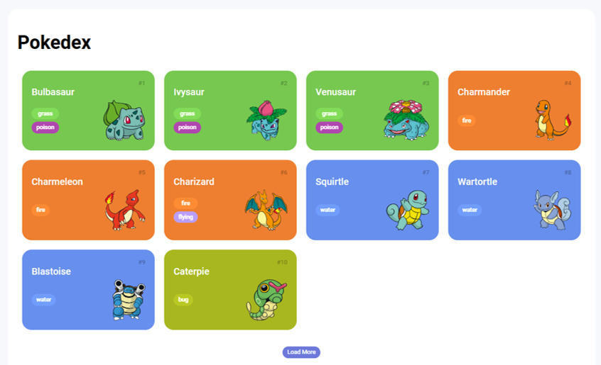

# Trilha JS Developer - Pokedex

<h1 aling= "center">🎮 POKEDEX </h1>

O projeto é uma aplicação simples que trás um conjunto de cards com informações sobre os mais variados tipos de pokémons!.

<h1 aling= "center">🛠️ Tecnologias utilizadas</h1>

<ul>
  <li><b> Html:</b> criação do corpo da página</li> 
  <li><b>CSS:</b> Estilização do cenário e área de gameplay</li>
  <li><b>JavaScript:</b> programar os movimentação do jogo</li>
</ul>

<h1 >💡 Habilidades desenvolvidas</h1> 
<ul>
  <li> Lógica da Programação </li>
  <li>Exploração dos conceitos de JavaScript como querySelector, sort e createElement.</li>
  <li>Manipulação dinâmica de classes CSS para movimentação dos Cards</li>
  <li>Detecção de cliques para receber elementos e comparar valores.</li>
</ul>

<h1> Site do jogo </h1>
    

 Para quem deseja visitar o site ele está disponivél no link:

https://duarte-arthur21.github.io/Jogo-da-memoria/
